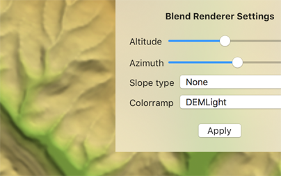

#Blend renderer

This sample demonstrates how to use blend renderer on a raster layer. You can get a hillshade blended with either a colored raster or color ramp.

##How to use the sample

The sample allows you to change the `Altitude`, `Azimuth`, `Slope type` and `Color ramp type`. You can click on the `Apply` button to update the raster. If you use `None` as the color ramp type, colored raster is blended with the hillshade output. For all the other types a color ramp is used.

##How it works

The sample uses `AGSBlendRenderer` class to generate blend renderers. The settings provided by the user are put in the initializer `init(elevationRaster:outputMinValues:outputMaxValues:sourceMinValues:sourceMaxValues:noDataValues:gammas:colorRamp:altitude:azimuth:zFactor:slopeType:pixelSizeFactor:pixelSizePower:outputBitDepth:)` to get a new renderer and the renderer is then set on the raster.

