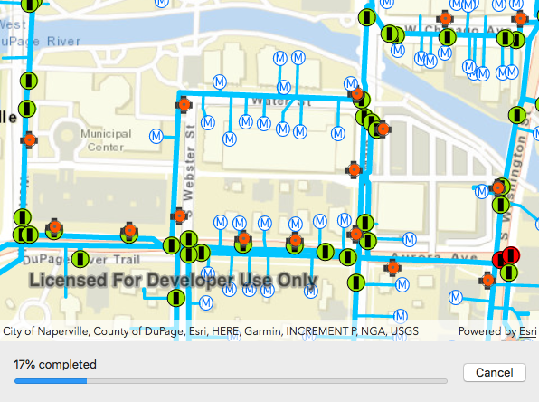

# Generate offline map

This sample demonstrates how to generate an offline map for a web map in ArcGIS Portal.

## How to use the sample

On the map, pan/zoom to the area you would like to take offline. The red rectangle shows the extent that will be downloaded. Click the `Generate Offline Map` button to initiate creation and download. A progress view is shown for feedback. You can click the `Cancel` button to stop the process. Once the download is complete, the offline map will be shown in the map view.

## How it works

Use the `AGSOfflineMapTask` to take maps offline. The sample creates a portal item object using a web map’s ID. This portal item is used to initialize an `AGSOfflineMapTask` object. On generate button's action, the sample gets the default parameters for the task with the selected extent. These parameters along with the download path for the offline map are then used to create an `AGSGenerateOfflineMapJob` object from the offline map task. This job is then started and on successful completion the offline map is added to the map view. To provide feedback to the user, the `progress` property of type `NSProgress` on the `AGSGenerateOfflineMapJob` is used. A KVO is set on the `fractionCompleted` property of the progress. And on each callback the progress view is updated with the progress value.

As the web map that is being taken offline contains an Esri basemap, this sample requires that you sign in with an ArcGIS Online organizational account.
