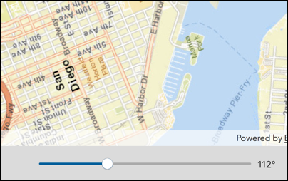

# Map rotation

This sample demonstrates how to rotate a map using a slider control.

## How it works

To set rotation of a map, `AGSMapView` provides a few methods. You can use the `setViewpointRotation(_:completion:)` method and give it an angle in degrees. Or you can create a rotated `AGSViewpoint` using `init(center:scale:rotation:)` or `init(targetExtent:rotation:)` and set it using the following methods on `AGSMapView` - `setViewpoint(_:)`, `setViewpoint(_:completion:)`, `setViewpoint(_:duration:completion:)`, `setViewpoint(_:duration:curve:completion:)`.

To listen for rotation angle changes, `AGSMapView` provides a block called `viewpointChangedHandler` which fires each time the viewpoint of the map view changes. The change could be because of a pan or a zoom or a rotation or a combination of these. You can also check the current rotation angle of a map by using the `rotation` property on `AGSMapView`

